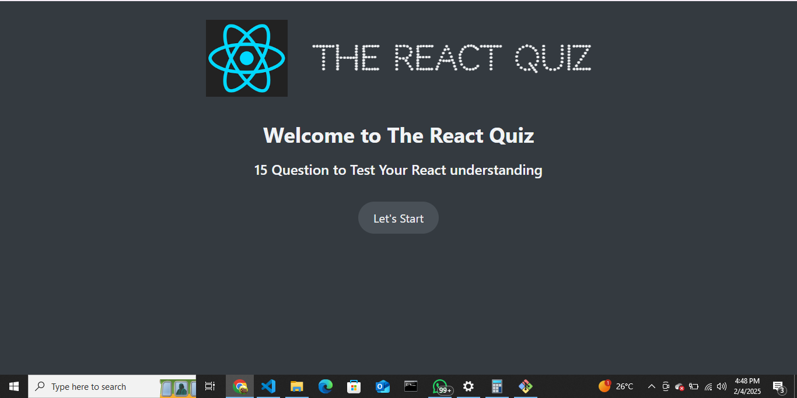
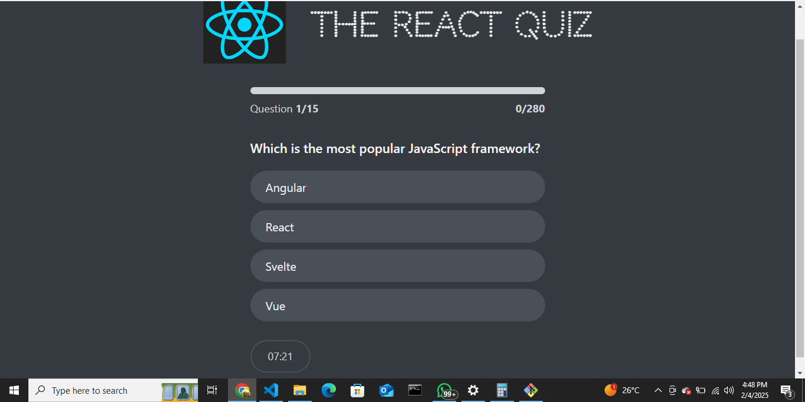
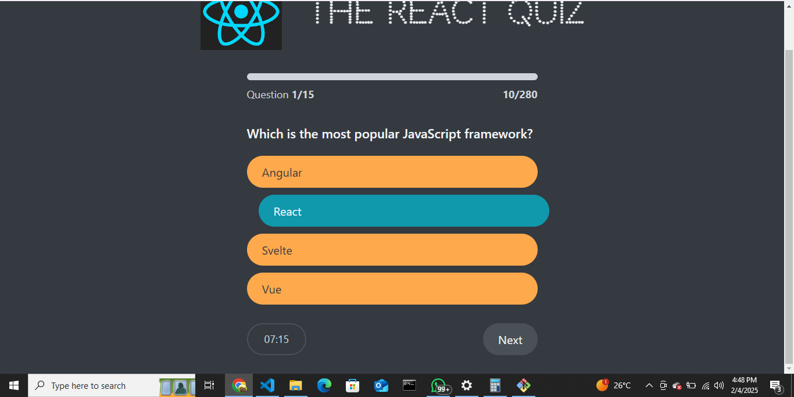
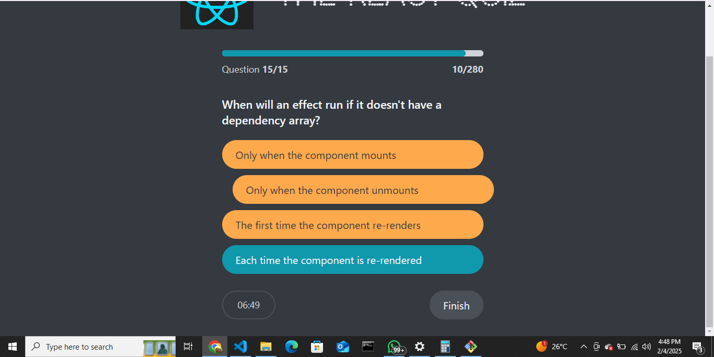
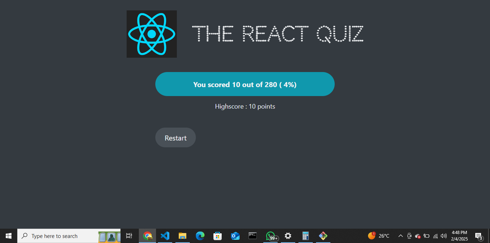

# React Quiz 🎯

A dynamic quiz application built with React to test your React.js knowledge. Features a timer, progress tracking, and high score system.

## Screenshots







## Features

- Interactive quiz interface
- Real-time progress tracking
- Timer for each question
- Score calculation system
- High score tracking
- Immediate answer feedback
- Responsive design

## Tech Stack

- React.js
- CSS3
- json-server (for backend mock)

## Installation

1. Clone the repository:
```bash
git clone https://github.com/zakyboss/react-quiz.git
```

2. Install dependencies:
```bash
cd react-quiz
npm install
```

3. Start the mock server:
```bash
npm run server
```

4. Start the development server:
```bash
npm start
```

## Usage

- Click "Let's Start" to begin the quiz
- Select your answer from multiple choices
- Track your progress through the progress bar
- Complete all questions before the timer runs out
- View your final score and highest score achieved

## Contributing

Pull requests are welcome. For major changes, please open an issue first to discuss what you would like to change.

## Author

[@zakyboss](https://github.com/zakyboss)

## License

[MIT](https://choosealicense.com/licenses/mit/)